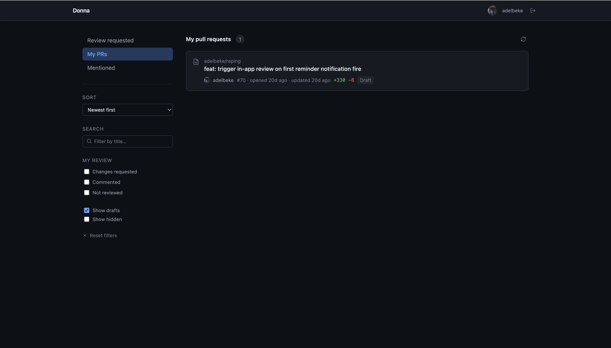

<div align="center">

# donna

GitHub PR dashboard — runs in your browser, no backend, no signup. Filter, prioritise, and track review status across all your repositories.

[](https://github.com/adelbeke/donna/actions/workflows/ci.yml)
[](LICENSE)

**[→ Live demo](https://adelbeke.github.io/donna/)**

</div>

<!-- TODO: replace with a real app screenshot -->


Client-only GitHub PR dashboard. No backend. Talks directly to the GitHub GraphQL API; your PAT is stored in `localStorage` and never leaves your browser.

## Features

- Three sections: **Review requested** · **My PRs** · **Mentioned**
- Filter by repository (multi-select), search by title, sort newest/oldest
- Filter by your own review state: changes requested / commented / not reviewed
- Star PRs as **top priority** — pinned to a separate section
- Hide PRs you don't care about; toggle to show drafts / hidden
- PR cards show repo, author, diff size, draft + review-state badges, CI status, conflict indicator, relative timestamps
- PAT stored in `localStorage`, never sent to any server; auto sign-out on token expiry

## Generate a token

Create a **classic** Personal Access Token with these two scopes:

| Scope | Why |
|---|---|
| `repo` | Read PRs, reviews, and diffs |
| `read:org` | Resolve team review requests |

[Generate token →](https://github.com/settings/tokens/new?scopes=repo,read:org)

> Your token is stored in `localStorage` and only used to call the GitHub API directly — it never touches any server.

## Quick start

```bash
npm install && npm run dev
```

Open `http://localhost:5173` and paste your token.

## Self-hosting / deploy

Auto-deploys to GitHub Pages on push to `main` via `.github/workflows/deploy.yml`. `base: '/donna/'` is set in `vite.config.ts`.

For any static host:

```bash
npm run build
```

Serve the `dist/` folder.

## Tech stack

React 19, Vite, TypeScript, Tailwind v4, Zustand (persist), TanStack Query, graphql-request, lucide-react.

## Contributing

Run before opening a PR:

```bash
npm run lint
npm run test:run
npm run build
```

See [CONTRIBUTING.md](CONTRIBUTING.md) for the full guide.

## License

MIT © [Arthur Delbeke](https://github.com/adelbeke)
